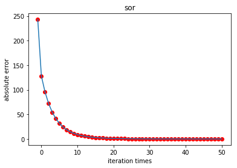

# report on numerical analysis

---
author:黄俊  studentID:16350027
---

## direct method to solve linear equation class

### Gauss Elimination


```

                for y in range(x+1,mat.shape[1]):
                    #if(mat[x][y]==0):
                    cover = mat[y][x] / mat[x][x]
                    #print(cover+99)
                    #print(cover)
                    mat[:][y] -= cover * mat[:][x]
                    #mat[x][y] = 0
                    ans[y] -= cover * ans[x]
                #print(mat[x,:])
            result = np.zeros(mat.shape[0])
            #print(result)
            #print(mat)
            #print(mat[1][0]+100)
            for y in range(mat.shape[0]-1,-1,-1):    
                result[y] = (ans[y] - np.sum((result[n]*mat[y][n]
                                              for n in range(y+1,len(result))))) / mat[y][y]

```


above is the basic code.

this method is quite a intuition method for people who just in middle school could think through and apply it to solve multi equation.

so the code is not much to talk about.but there's something to be noticed is that when we choose a new row we have to make that the first element couldnt be zero and if its zero we have to switch it with next none-zero element.

and when we switch it that we must make sure that the result vector of the equations must be also switch to the correctsponding position.


### Column principal elimination method


```
or x in range(mat.shape[0]-1):
                if(mat[x][x]==0):
                        y_none_zero = find_abs_max(mat,x,x)
                        if(mat[x][x] == 0):
                            print('wrong det(mat)=0')
                            return False
                        mat[:,[x,y_none_zero]] = mat[:,[y_none_zero,x]]
                        (ans[x],ans[y_none_zero]) = (ans[y_none_zero],ans[x])
                for y in range(x+1,mat.shape[1]):
                    #if(mat[x][y]==0):
                    #if(mat[x][y]==0):
                    cover = mat[y][x] / mat[x][x]
                    #print(cover+99)
                    #print(cover)
                    mat[:][y] -= cover * mat[:][x]
                    #mat[x][y] = 0
                    ans[y] -= cover * ans[x]
            result = np.zeros([mat.shape[0]])
            for y in range(mat.shape[0]-1,-1,-1):
                result[y] = (ans[y] - np.sum((result[n]*mat[y][n]
                                              for n in range(y+1,mat.shape[0])))) / mat[y][y]
            return result
```

the code above is the column main elimation method to solve multi linear equation problem.

after all,the only difference between column main and guass elimation method is that for which we using guass method because we would like to choose the first non-zero element as the divider.

so we can make sure the state of divider,what if the divider gets to small that might lead to huge precision error which can be hurtful because what we want is a precious result.

so we apply the column main method which make sure in each row or say each iteration we choose the largest element from all the elements from the single column.

which is effientily make the possiblity of letting precision error ruin our work gets to the smallest possiblity.

## iteration method

### jacobi method


because jacobi method require a lot about the diag dominate,so i construct the matrix to fit this limitation

```
        for y_ in range(A.shape[0]-1,1,-1):
            A[y_-1][:] += random.randint(1,2)/5*A[y_][:]
        for y_ in range(1,A.shape[0]):
            A[y_][:] += random.randint(1,2)/10 * A[y_-1][:]
```

and jacobi method work in problem specified well

### guass-seidel


although guass-seidel method dint require diag dominate matrix but to compare with the jacobi method we still takes the same matrix.

as you can see from the chart,guass-seidel method is quite quick converge than the jacobi mthod.

### sor method





which can be seen from the chart that the sor method seems converge not that quite,because i take a self-adaption method to make sure each step of this method must be converge which might result into the converge too slow side-effect


### conjugated-gd  method


looks like specify to this problem,conjugated-gd just like the average level


### the cost time of each iteration method


the final result is guass-seidel is second fast in this situation and jacobi and self-adaption sor are almost the same and the gd method is most fast
## pageranker alo
the idea of pageranker is very simple just using the power method we can easily by using iteration to converge the PR value of each website into the predefine 
formula 

$$ pr() = 0.85 * \sum_{n=0}^{n=dims}pr_n*1/\sum_{k=0}^{k=n}(website n refer to?1:0) + 0.15 * \sum_{n=0}^{n=dims}pr_n/dims $$
the first part means how many website refer to this website and multiply with each's pagerank value to show how import this website is.

the second part is to simulate the true situation of you have 0.15 possiblity to view different random website.

and we can using a matrix to represent the viewer transfer possiblity by doing a little bit extra work on the initial linked graph matrix. 

presdo code as follow
```
class pagerank_gpu_pytorch():
    def __init__():
        self.dims = 75879
        self.apha = 0.85
        f2 = open('pytorch_linked_matrix.txt','w+')
        if(len(f2.read()) == 0):
            self.S = torch.zeros([self.dims,self.dims],dtype=torch.cuda.float).cuda()
            self.S = nn.DataParallel(self.S)
```
to actualy write this program is very simple but how to run it can be a real program,so i figure out two ways

1. simple using dict to present sparse matrix to reduce time difficulties because that's only 100 thousand edge out of 70000*70000 matrix is not zero.but numpy or other py libary seems not support very well with this sparse matrix operation. so once if i want to using sparse matrix i have to rewrite a class of sparse matrix.but its not very be expected by me because i dont know how to optimize the program in parrelize of in gpu.

```
def dot2(v1):
    B = np.zeros(dims)
    for index in list(occur_arr.keys()):
        if(occur_arr[index] != 0):
            _sum = 0
            k = 1 / occur_arr[index]
            for index2 in occurence[index]:
                _sum += k * v1[index2][0]
            B[index] = _sum
    #print(_sum)
        if(index%10000 == 0):
            print(time.time())
    return B.reshape(-1,1)
```
the basic code is like that i try to use python's dictionary to simulate as sparse matrix,and all the work was done by analysis the final formula


2. so the second way to accomplish this work is quite clear.because what i have done with sparse cant get the well support of gpu and parrelize computation,we have to reach out for framework which can be done with gpu,so there comes two option numpy and pytorch,numpy is not for gpu so the only opportunity lead me to the pytorch.

    but clearly pytorch also have sparse matrix operation,have to done it on normal matrix,but allocate the 70000*70000 float32 matrix would cost nearly 50Gb space,what should i do with that.

    thanks to the tianhe2 supercomputer make it all doesnt matter right now
    
    
    
    没错 有超算就是可以这么为所欲为
    after i dump all the alo and data into the tianhe2,all the process was going smoothly as i cant ever expect.
    and the code is using pytorch framework's cuda module which aims to full use the gpu by loading all the data into the gpu memory instead of normal memory.

```
class pagerank_gpu_pytorch():
    def __init__():
        self.dims = 75879
        self.apha = 0.85
        f2 = open('pytorch_linked_matrix.txt','w+')
        if(len(f2.read()) == 0):
            self.S = torch.zeros([self.dims,self.dims],dtype=torch.cuda.float).cuda()
            self.S = nn.DataParallel(self.S)
```
    and the final result is below,as you can see that many of website converge to the same value which is werid,but in my theory it might result from these website have unusual py trade which means that all the website are linking to each other and lead to make them all have the same pagerank value.
    ```
    [(7307, array([1.31615315e-05])), (7776, array([1.31615315e-05])), (7807, array[1.31615315e-05])), (31001, array([1.31615315e-05])), (31954, array([1.31615315e-05])), (32341, array([1.31615315e-05])), (33124, array([1.31615315e-05])), (33493, array([1.31615315e-05])), (33495, array([1.31615315e-05])), (34580, array([1.31615315e-05])),  (39744, array([1.31615315e-05])), (39862, array([1.31615315e-05])), (40235, array([1.31615315e-05])), (40243, array([1.31615315e-05])), (40452, array([1.31615315e-05])), (40532, array([1.31615315e-05])), (41596, array([1.31615315e-05])), (41743, array([1.31615315e-05])), (42075, array([1.31615315e-05])), (42115, array([1.31615315e-05])), (42329, array([1.31615315e-05])), (42741, array([1.31615315e-05])), (42805, array([1.31615315e-05])), (43264, array([1.31615315e-05])), (43265, array([1.31615315e-05])), (43417, array([1.31615315e-05])), (43435, array([1.31615315e-05])), (43472, array([1.31615315e-05])), (43571, array([1.31615315e-05])), (43766, array([1.31615315e-05])), (43990, array([1.31615315e-05])), (44235, array([1.31615315e-05])), (44259, array([1.31615315e-05])), (44367, array([1.31615315e-05])), (44424, array([1.31615315e-05])), (44434, array([1.31615315e-05])), (44491, array([1.31615315e-05])), (44522, array([1.31615315e-05])), (44523, array([1.31615315e-05])), (44524, array([1.31615315e-05])), (44525, array([1.31615315e-05])), (44526, array([1.31615315e-05])), (45564, array([1.31615315e-05])), (45803, array([1.31615315e-05])), (45804, array([1.31615315e-05])), (65990, array([1.28500881e-05])), (63516, array([1.28497336e-05])), (67283, array([1.28481298e-05])), (70271, array([1.28479164e-05])), (70310, array([1.28479164e-05])), (70311, array([1.28479164e-05])), (66963, array([1.28479097e-05])), (62936, array([1.28478918e-05])), (62938, array([1.28478918e-05])), (62939, array([1.28478918e-05])), (32564, array([1.28473748e-05])), (70218, array([1.28469498e-05])), (71185, array([1.28458919e-05])), (54863, array([1.28452552e-05])), (68981, array([1.28452552e-05])), (67482, array([1.28448207e-05])), (70054, array([1.28446811e-05])), (54533, array([1.28442618e-05])), (73821, array([1.28441024e-05])), (62609, array([1.28428198e-05])), (55831, array([1.28427452e-05])), (53337, array([1.28425785e-05])), (47401, array([1.28420676e-05])), (52953, array([1.28420054e-05])), (67623, array([1.28419386e-05])), (70005, array([1.28417951e-05])), (70006, array([1.28417951e-05])), (35846, array([1.28414163e-05])), (52141, array([1.28407195e-05])), (55107, array([1.28395239e-05])), (64108, array([1.28394459e-05])), (64109, array([1.28394459e-05])), (75483, array([1.28387474e-05])), (75484, array([1.28387474e-05])), (75485, array([1.28387474e-05])), (51908, array([1.28387331e-05])), (49108, array([1.28381517e-05])), (61634, array([1.28373412e-05])), (61635, array([1.28373412e-05])), (62748, array([1.28368298e-05])), (8046, array([1.28367627e-05])), (64658, array([1.2835686e-05])), (47409, array([1.28348924e-05])), (58341, array([1.28345157e-05])), (70219, array([1.28341965e-05])), (43802, array([1.28330911e-05])), (31410, array([1.28325968e-05])), (52173, array([1.28324629e-05])), (75654, array([1.28310302e-05])), (75655, array([1.28310302e-05])), (75656, array([1.28310302e-05])), (75657, array([1.28310302e-05])), (32801, array([1.28309554e-05])), (61314, array([1.28309385e-05])), (37172, array([1.28278526e-05])), (8042, array([1.2827325e-05])), (43531, array([1.28267346e-05])), (36470, array([1.28263243e-05])), (39067, array([1.28257915e-05])), (5892, array([1.28247749e-05])), (45797, array([1.28246774e-05])), (71215, array([1.28241682e-05])), (70730, array([1.28240865e-05])), (70732, array([1.28240865e-05])), (60402, array([1.28227312e-05])), (27311, array([1.28222054e-05])), (45806, array([1.28216558e-05])), (70086, array([1.28213354e-05])), (69872, array([1.28204425e-05])), 
    ```
